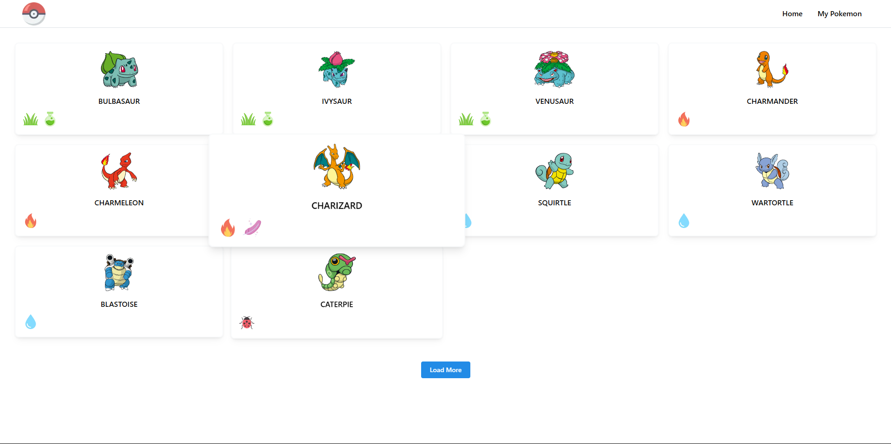
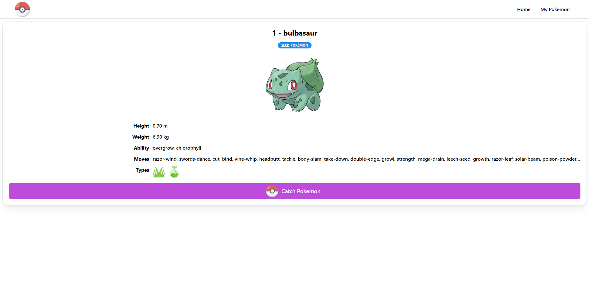
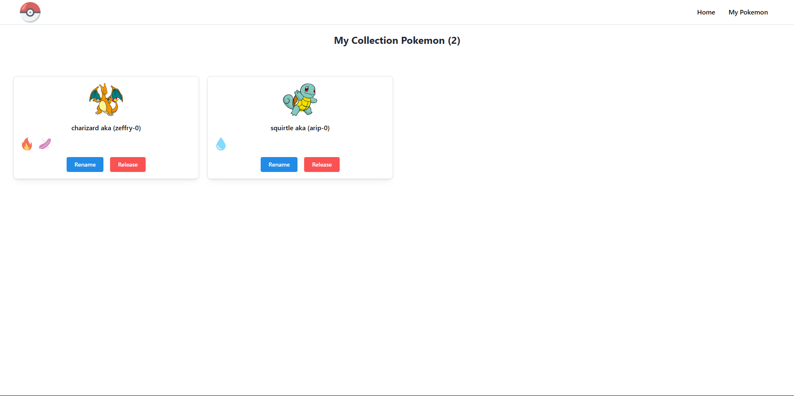
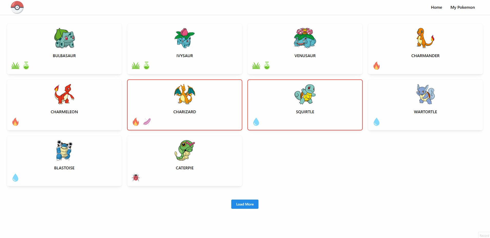
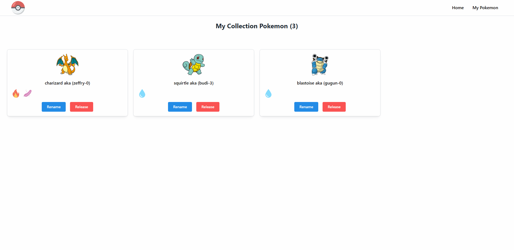
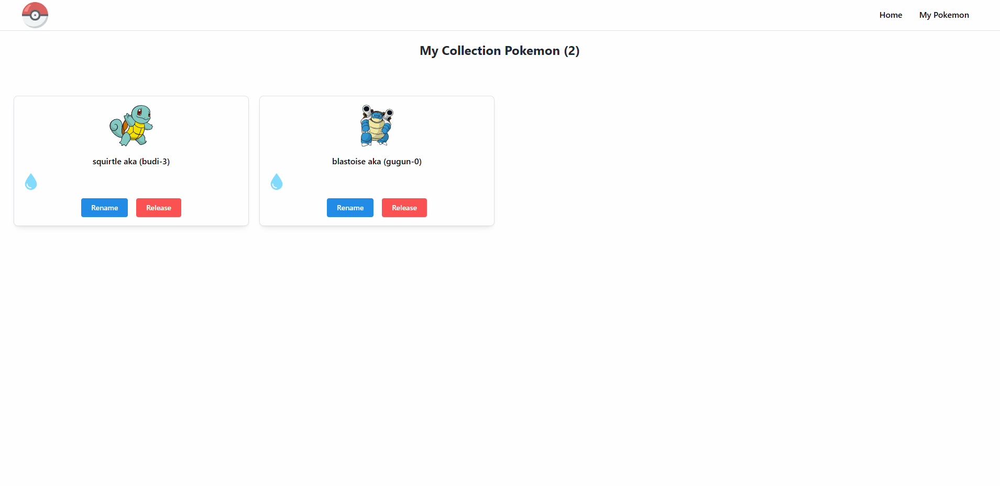

# Frontend for Library Apps

The project builds using Next JS, Tailwind CSS, Mantine, SWR, Zustand

## Manual Installation

```bash
git clone https://github.com/zgramming/phincon-pokemon-fe.git
cd phincon-pokemon-fe
```

Install the dependencies:

```bash
npm install
```

Set the environment variables:

```bash
cp .env.example .env
# open .env and modify the environment variables
```


## Table of Contents

- [Commands](#commands)
- [Environment Variables](#environment-variables)
- [Pages](#pages)

## Commands

Running in development:

```bash
npm run dev
```

Running in production:

```bash
# build
npm run build
# start
npm run start
```

## Environment Variables

The environment variables can be found and modified in the `.env` file.

```bash
# API Url
NEXT_PUBLIC_BASE_API_URL = 'http://localhost:4000/api/v1'
NEXT_PUBLIC_BASE_API_POKEMON_URL = 'https://pokeapi.co/api/v2'
```

### Pages
List of available pages:

**Home**\


**Detail**\


**My Pokemon**\


**Flow Catch Pokemon**\


**Flow Release Pokemon**\


**Flow Rename Pokemon**\


